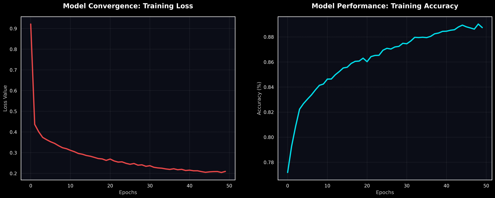
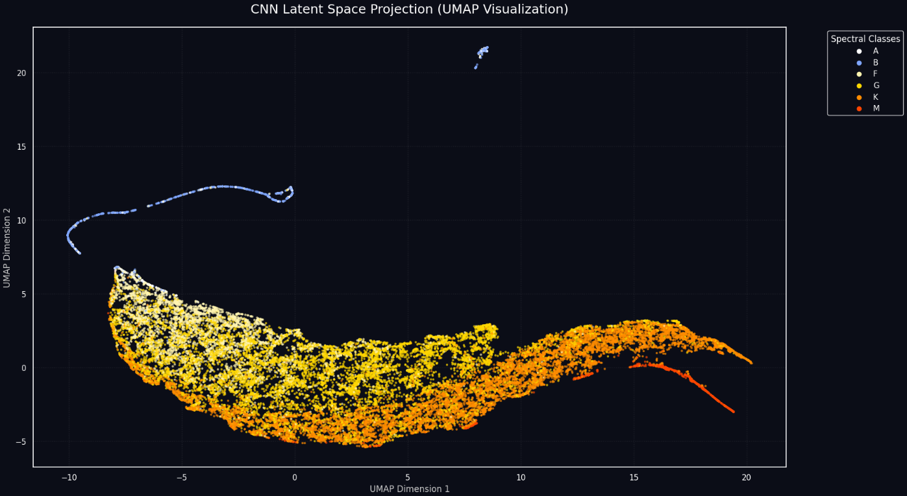

# 🔭 Gaia DR3 Stellar Classification with JAX/Flax


This repository contains the advanced deep learning project I developed during my **Erasmus+ Research Internship at Heidelberg University, Germany**. The project focuses on the automated classification of stellar spectral types using high-resolution, 1D spectroscopy data from the European Space Agency's (ESA) Gaia Mission.

---

## 📌 Project Overview

| Category | Details |
| :--- | :--- |
| **Institution** | Heidelberg University (Research Internship) |
| **Data Source** | ESA Gaia DR3 RVS Mean Spectra |
| **Framework** | JAX / Flax (NNX) |
| **Architecture** | 1D-Convolutional Neural Network (CNN) |
| **Accuracy** | 81% (Global Test Set) |

---

## 🧬 Methodology & Pipeline

### 1. Exploratory Data Analysis (EDA) & Wrangling
The process began with an in-depth analysis of the raw Gaia dataset to ensure data quality:
* **Sky Distribution:** Analyzed source distribution using **Aitoff projection** in Galactic coordinates.
* **Data Transformation:** Built custom parsers to convert JSON spectral strings into optimized NumPy arrays.
* **Spectral Profiling:** Visualized **Flux** and **Flux Error** profiles to assess signal-to-noise ratios.
* **Class Distribution:** Identified significant class imbalance, informing the use of cost-sensitive learning.


### 2. Smart Data Acquisition (Astroquery)
Instead of relying on static files, the pipeline dynamically interacts with ESA servers:
* **ADQL Queries:** Directly retrieves target labels (Teff) and source IDs using `astroquery.gaia`.
* **Batch Processing:** Implements robust error handling and rate-limiting for optimized data streaming.

### 3. Neural Architecture (1D-CNN)
Designed a high-performance **1D-CNN** to capture local spectral features (absorption lines):
* **Layers:** 3 Convolutional stages (16, 32, 64 filters) with Batch Normalization and Dropout.
* **Optimization:** Leverages **JIT compilation** for speed and **Optax (AdamW)** for stable updates.
* **Handling Imbalance:** Custom class weights integrated into the Softmax Cross-Entropy loss.

---

## 📊 Results & Visualization

### Model Performance Analysis
The model achieves an overall accuracy of **81%**. 

* **High-Confidence Classes:** Exceptional results for **M-type (92% F1-score)**, **B-type (87%)**, and **K-type (87%)** stars.
* **Data Scarcity Challenges:** Lower performance in **Class A (39%)** is due to extreme data imbalance (only 342 samples vs 10k+ in G/K types).


### Training History & Convergence
The stable decrease in loss and steady rise in accuracy demonstrate an effective learning rate and robust optimization.


### Latent Space Representation
To validate feature extraction, I used **UMAP** to project the model's internal representations (logits) into a 2D space. The clustering clearly aligns with the astronomical spectral sequence.



---

## 📁 Repository Structure

```text
├── Stellar_Classification_Final.ipynb
├── images/
│   ├── sky_distribution.png
│   ├── quality_metrics_pairplot.png
│   ├── flux_graph.png
│   ├── flux_error_graph.png
│   ├── classification_report.png
│   └── umap_projection.png
├── models/
│   ├── stellar_model_dict.joblib
│   ├── scaler.joblib
│   └── label_encoder.joblib
├── .gitattributes
├── .gitignore
├── LICENSE
├── requirements.txt
└── README.md
