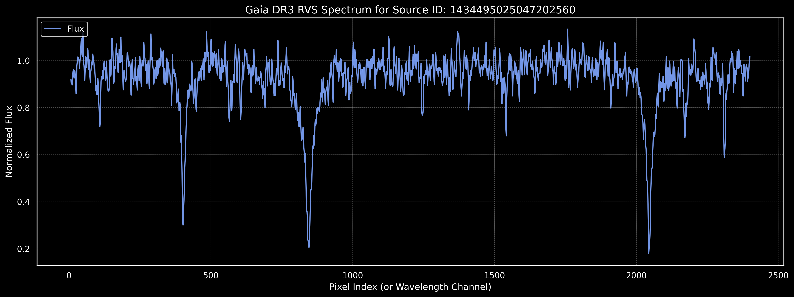
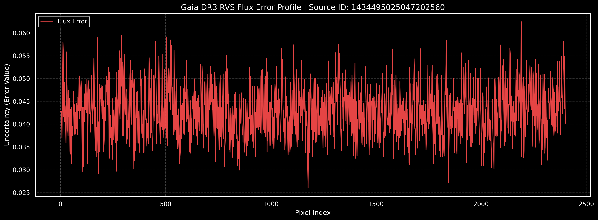

# 🔭 Gaia DR3 Stellar Classification with 1D-CNN


This repository contains the advanced deep learning project I developed during my **Erasmus+ Research Internship at Heidelberg University, Germany**. The project focuses on the automated classification of stellar spectral types using high-resolution, 1D spectroscopy data from the European Space Agency's (ESA) Gaia Mission.

---

## 📌 Project Overview

| Category | Details |
| :--- | :--- |
| **Institution** | Heidelberg University (Research Internship) |
| **Data Source** | ESA Gaia DR3 RVS Mean Spectra |
| **Framework** | JAX / Flax (NNX) |
| **Architecture** | 1D-Convolutional Neural Network (CNN) |
| **Accuracy** | 81% (Global Test Set) |

---

## 🧬 Methodology & Pipeline

### 1. Smart Data Acquisition (Astroquery)
Instead of static files, the pipeline uses **Astroquery** to interact with ESA servers:
* **ADQL Queries:** Directly retrieves target labels (Teff) and source IDs from the Gaia Archive.
* **Batch Processing:** Implements robust error handling and rate-limiting to download data in optimized chunks.

### 2. Neural Architecture (1D-CNN)
Designed a high-performance **1D-CNN** to capture local spectral features (absorption/emission lines):
* **Layers:** 3 Convolutional stages (16, 32, 64 filters) with Batch Normalization and Dropout.
* **Optimization:** Leverages **JIT compilation** for speed and **Optax (AdamW)** for stable gradient updates.
* **Handling Imbalance:** Custom class weights integrated into the Softmax Cross-Entropy loss.

---

## 📊 Results & Visualization

### Latent Space Representation
To validate the model's feature extraction, I used **UMAP** to project the internal representations (logits) into a 2D space. The clustering clearly aligns with the astronomical spectral sequence.


### Spectral Analysis
Sample visualizations of the Gaia DR3 RVS processed spectra:



---

## 📁 Repository Structure

```text
├── Stellar_Classification_Final.ipynb
├── images/
│   ├── umap_projection.png
│   ├── flux_graph.png
│   └── flux_error_graph.png
├── models/
│   ├── stellar_model_dict.joblib
│   ├── scaler.joblib
│   └── label_encoder.joblib
├── .gitattributes
├── .gitignore
├── LICENSE
├── requirements.txt
└── README.md
